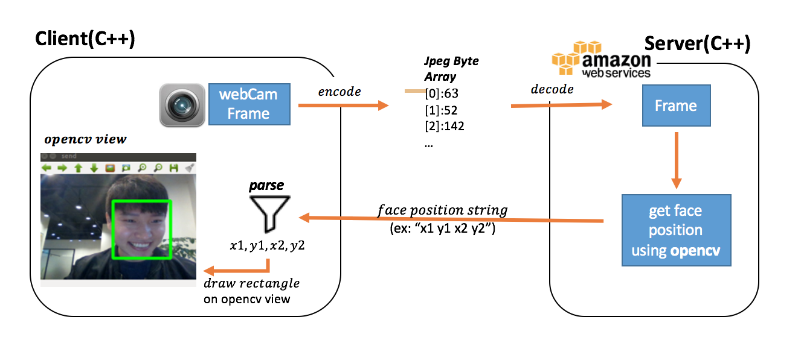
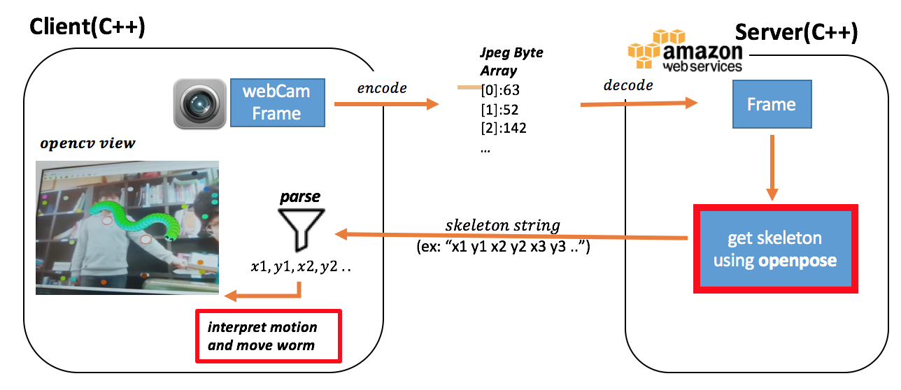
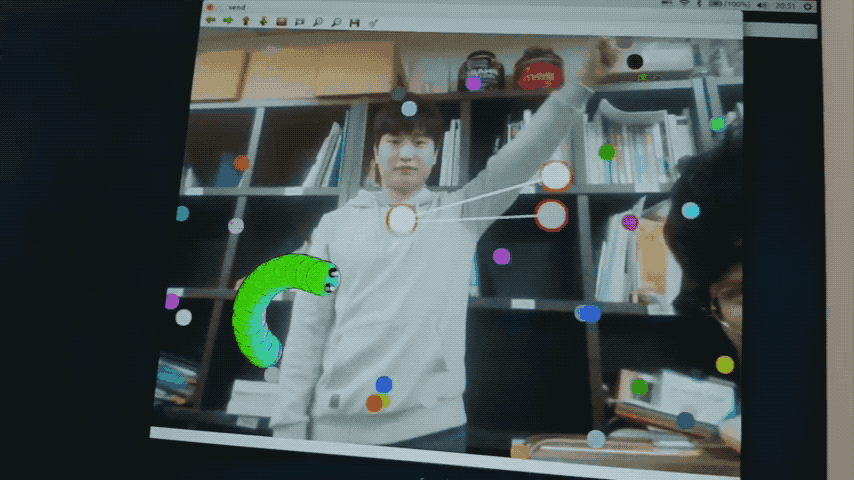
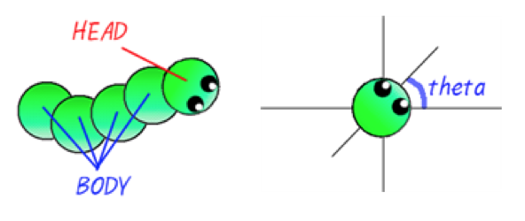


**2조 나비효과 - 영상인식기술을 활용한 동작인식 시스템**
- 한승범, 나선엽, 김상연

## Contents
1. [Results](#results)
2. [Our Development Diary](#our-development-diary)
3. [More Information](#more-information)

# Results

#### Demo

	
    

---

#### Software architecture & Internal logic

    
    

  
    
# Our Development Diary

- **17.10.05 : simple client-server face tracking program**

    

This is the program we first created for the project. 
It is designed to create the **overall framework** of the project. 
The framework of our project is as follows.
   
	1. send real-time image frames from client to server.
	2. send the value of interpreting frame using openpose.
	3. reflects the values in BattleWorms.

AWS Server is needed because openpose requring a high-quilty-computer is difficult to develop on a personal computer. but at this program, we used **simple-face-detection-module** instead of using **openpose** since we had not yet analyzed it.

---

- **17.10.30 : openpose analysis**

The next step is to replace the **simple-face-detection-module** to **openpose**. There are three basic examples of openpose tutorial.

	Running on webcam.
	Running on video.
	Running on images.

We decided to analyze the examples here and develop our program. but It was harder than we thought. there were no examples available in the client-server structure. After much thinking, we decided to analyze and use third example because we felt we could solve the problem by replacing the image file with the frame received from the client.

---

- **17.12.04 : completed BattleWorms for a single player**

    
    
	

    

We made our project BattleWorms in which one player can play. By sending a real-time camera frame, the server sends out the coordinates of the detected person's skeleton on that frame, and the client analyzes the coordinates to move the worm, which  consists of a head and a tail, and a head has theta, so it moves in the direction of theta on every frame. 
 
We have a problem to tackle before we extend the project to multiple people.

	1. Ineffective Image Processing : we draw every tails at camara frame.
	2. Camera and worms use same frame  : it necessary to separate the camera and game views.
	2. Difficult to develope the intended UI

It was decided to solve the first problem by unity and we thought the second problem would be simpler if we used **android.**
	

---

- 18.02.22 : changed our program architecture
- 18.03.18 : completed BattleWorms for 3 players
- ~ adding game effect and enhancing color-based filter 

## More Information

- Filter (How we distinguish players between different people)
- Game rules
- How BattleWorms started

## OpenSource

We are making our program using OpenPose!

OpenPose is authored by [Gines Hidalgo](https://www.gineshidalgo.com/), [Zhe Cao](http://www.andrew.cmu.edu/user/zhecao), [Tomas Simon](http://www.cs.cmu.edu/~tsimon/), [Shih-En Wei](https://scholar.google.com/citations?user=sFQD3k4AAAAJ&hl=en), [Hanbyul Joo](http://www.cs.cmu.edu/~hanbyulj/), and [Yaser Sheikh](http://www.cs.cmu.edu/~yaser/). Currently, it is being maintained by [Gines Hidalgo](https://www.gineshidalgo.com/) and [Bikramjot Hanzra](https://www.linkedin.com/in/bikz05). The [original CVPR 2017 repo](https://github.com/ZheC/Multi-Person-Pose-Estimation) includes Matlab and Python versions, as well as the training code. The body pose estimation work is based on [the original ECCV 2016 demo](https://github.com/CMU-Perceptual-Computing-Lab/caffe_rtpose).

## License
This program follows the licensing of the OpenPose. freely available for free non-commercial use, and may be redistributed under these conditions. Please, see the [license](LICENSE) for further details. 
