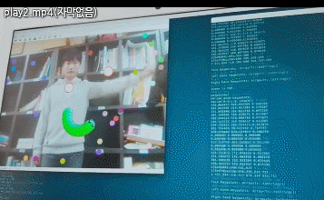
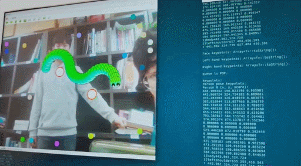
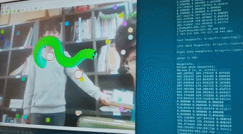


**2조 나비효과 - 영상인식기술을 활용한 동작인식 시스템**
- 한승범, 나선엽, 김상연

## About Project 
- 2017.12.09 : **AWS동기화 코드** 작성
- 2017.12.04 : **1차프로젝트 완성**
- 2017.11.20 : **오픈포즈 서버 연동 해결** 
- 2017.10.30 : **멘토과제#2 해결** (오픈포즈 빌드 및 분석)
- 2017.10.05 : **멘토과제#1 해결** (서버 ,클라이언트 동영상 스트리밍, 프레임 분석)

## Results
### 1

    

### 2

    

###3

    

## Contributors

OpenPose is authored by [Gines Hidalgo](https://www.gineshidalgo.com/), [Zhe Cao](http://www.andrew.cmu.edu/user/zhecao), [Tomas Simon](http://www.cs.cmu.edu/~tsimon/), [Shih-En Wei](https://scholar.google.com/citations?user=sFQD3k4AAAAJ&hl=en), [Hanbyul Joo](http://www.cs.cmu.edu/~hanbyulj/), and [Yaser Sheikh](http://www.cs.cmu.edu/~yaser/). Currently, it is being maintained by [Gines Hidalgo](https://www.gineshidalgo.com/) and [Bikramjot Hanzra](https://www.linkedin.com/in/bikz05). The [original CVPR 2017 repo](https://github.com/ZheC/Multi-Person-Pose-Estimation) includes Matlab and Python versions, as well as the training code. The body pose estimation work is based on [the original ECCV 2016 demo](https://github.com/CMU-Perceptual-Computing-Lab/caffe_rtpose).

In addition, OpenPose would not be possible without the [CMU Panoptic Studio dataset](http://domedb.perception.cs.cmu.edu/).

We would also like to thank all the people who helped OpenPose in any way. The main contributors are listed in [doc/contributors.md](doc/contributors.md).

## License
This program is freely available for free non-commercial use, and may be redistributed under these conditions. Please, see the [license](LICENSE) for further details. 