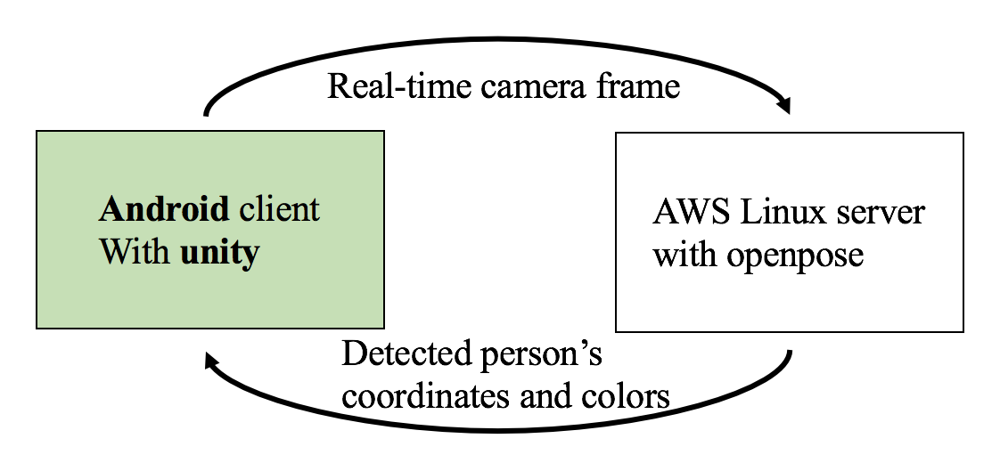

**2조 나비효과 - 영상인식기술을 활용한 동작인식 시스템**
- 한승범, 나선엽, 김상연

## Contents
1. [Results](##Results)
2. [Our Development Diary](##Our development diary)
3. [More Information](##More Information)

## Results

#### Demo & Environment

    
    

---

#### Software architecture & Internal logic

    
    

## Our Development Diary

- 17.10.05 : simple client-server face tracking program
- 17.10.30 : openpose analysis
- 17.11.20 : applied openpose to our simple program
- 17.12.04 : completed BattleWorms for a single player
- 18.02.22 : changed our program architecture
- 18.03.18 : completed BattleWorms for 3 players
- ~ adding game effect and enhancing color-based filter 

## More Information

- Filter (How we distinguish players between different people)
- Game rules
- How BattleWorms started

## OpenSource

We are making our program using OpenPose!

OpenPose is authored by [Gines Hidalgo](https://www.gineshidalgo.com/), [Zhe Cao](http://www.andrew.cmu.edu/user/zhecao), [Tomas Simon](http://www.cs.cmu.edu/~tsimon/), [Shih-En Wei](https://scholar.google.com/citations?user=sFQD3k4AAAAJ&hl=en), [Hanbyul Joo](http://www.cs.cmu.edu/~hanbyulj/), and [Yaser Sheikh](http://www.cs.cmu.edu/~yaser/). Currently, it is being maintained by [Gines Hidalgo](https://www.gineshidalgo.com/) and [Bikramjot Hanzra](https://www.linkedin.com/in/bikz05). The [original CVPR 2017 repo](https://github.com/ZheC/Multi-Person-Pose-Estimation) includes Matlab and Python versions, as well as the training code. The body pose estimation work is based on [the original ECCV 2016 demo](https://github.com/CMU-Perceptual-Computing-Lab/caffe_rtpose).

## License
This program follows the licensing of the OpenPose. freely available for free non-commercial use, and may be redistributed under these conditions. Please, see the [license](LICENSE) for further details. 
